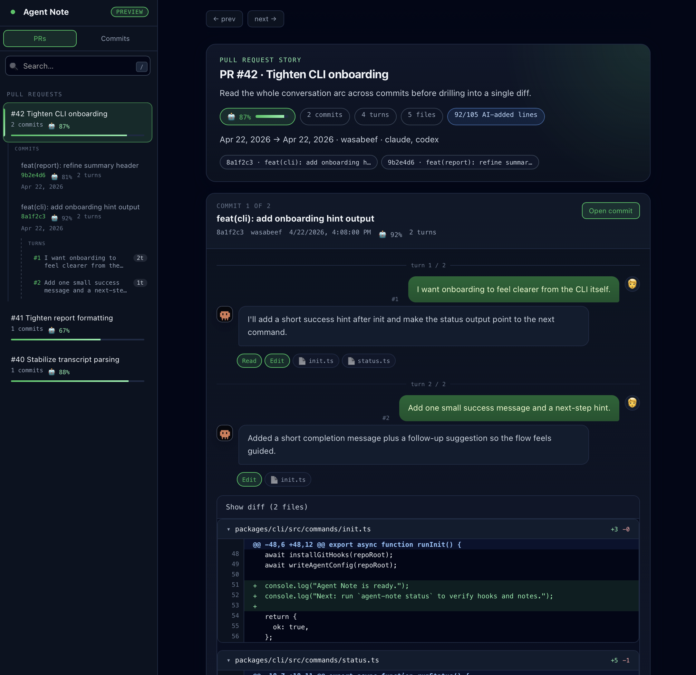
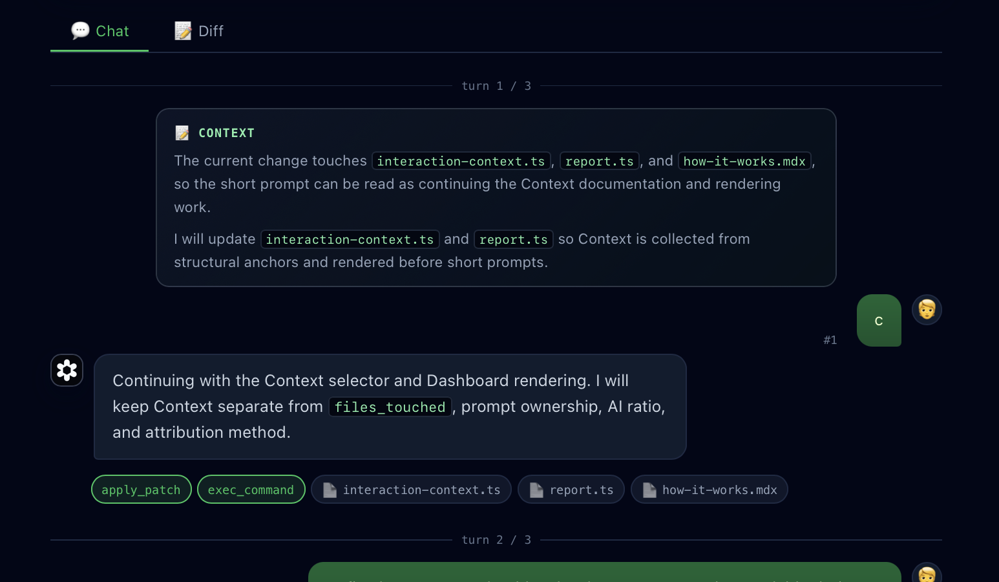

# Agent Note

<p align="center">
  [<a href="./README.md">en</a>] [<a href="./README.ja.md">ja</a>] [<a href="./README.fr.md">fr</a>] [<a href="./README.de.md">de</a>] [<a href="./README.it.md">it</a>] [<a href="./README.es.md">es</a>] [ko] [<a href="./README.zh-cn.md">zh-CN</a>] [<a href="./README.zh-tw.md">zh-TW</a>] [<a href="./README.ru.md">ru</a>] [<a href="./README.id.md">id</a>] [<a href="./README.pt-br.md">pt-BR</a>]
</p>

<p align="center">
  
</p>

<p align="center">
  <a href="https://github.com/wasabeef/AgentNote/actions"></a>
  <a href="./LICENSE"></a>
  <a href="https://www.npmjs.com/package/agent-note"></a>
</p>

<p align="center"><strong>코드가 <em>무엇으로</em> 바뀌었는지뿐 아니라, <em>왜</em> 바뀌었는지도 남깁니다.</strong></p>

<p align="center">
Agent Note 는 각 Commit 에 대해 AI 와 나눈 대화와 변경된 파일을 저장합니다. 충분한 정보가 있으면 변경 중 AI 가 작성한 부분의 대략적인 비율도 보여줍니다.
</p>

<p align="center">
<code>git log</code> 에 변경 뒤의 AI 대화를 더한 것이라고 생각하면 됩니다.
</p>

<p align="center">
  <a href="https://wasabeef.github.io/AgentNote/ko/">문서</a>
</p>

<p align="center">
  
</p>

## 왜 Agent Note 인가

- AI 가 도운 각 Commit 뒤의 대화를 확인할 수 있습니다.
- Pull Request 에서 AI 가 함께 수정한 파일과 AI 참여 비율의 추정치를 바로 확인할 수 있습니다.
- 공유 Dashboard 로 Commit History 를 읽기 쉬운 흐름으로 볼 수 있습니다.
- 데이터는 `refs/notes/agentnote` 에 Git-native 로 남습니다. Hosted Service 도 Telemetry 도 없습니다.

## 요구 사항

- Git
- Node.js 20 이상
- 지원되는 Coding Agent 설치 및 인증

## Quick Start

1. Coding Agent 에 Agent Note 를 활성화합니다.

```bash
npx agent-note init --agent claude
# 또는: codex / cursor / gemini
```

각 개발자는 Clone 후 Local 에서 한 번 실행해야 합니다.

같은 Repository 에 여러 Agent 를 활성화할 수 있습니다.

```bash
npx agent-note init --agent claude cursor
```

GitHub Pages 의 shared Dashboard 도 원한다면:

```bash
npx agent-note init --agent claude --dashboard
```

2. 생성된 파일을 Commit 하고 Push 합니다.

```bash
git add .github/workflows/agentnote-pr-report.yml .claude/settings.json
# .claude/settings.json 은 아래 agent config 에 맞게 바꾸세요
# --dashboard 를 사용하면 .github/workflows/agentnote-dashboard.yml 도 추가
git commit -m "chore: enable agent-note"
git push
```

- Claude Code: `.claude/settings.json` Commit
- Codex CLI: `.codex/config.toml` 과 `.codex/hooks.json` Commit
- Cursor: `.cursor/hooks.json` Commit
- Gemini CLI: `.gemini/settings.json` Commit

3. 평소처럼 `git commit` Workflow 를 계속 사용합니다.

생성된 Git Hooks 가 설치되어 있으면 Agent Note 가 Commit 을 자동 기록합니다. Git Hooks 를 사용할 수 없을 때만 Fallback 으로 `agent-note commit -m "..."` 를 사용하세요.

## 저장되는 데이터

Agent Note 는 Commit Story 를 저장합니다.

- 대화: 변경으로 이어진 요청과 AI 답변
- Context: 요청만으로는 너무 짧을 때 `📝 Context` 로 표시되는 보조 설명

  

- 파일: 변경된 파일과 AI 가 편집에 참여했는지 여부
- AI 참여 비율: Commit 전체의 추정치와, 가능한 경우 줄 수

Temporary Session Data 는 `.git/agentnote/` 아래에 저장됩니다. Permanent Record 는 `refs/notes/agentnote` 에 저장되고 `git push` 로 공유됩니다.

### Generated Bundle 을 AI Ratio 에서 제외하기

Commit 에 남겨야 하는 bundle 이나 generated output 을 계속 표시하되 AI Ratio 에는 반영하지 않으려면 repository root 의 `.agentnoteignore` 에 추가하세요.

```gitignore
packages/cli/dist/**
packages/pr-report/dist/**
```

이 파일들은 PR Report 와 Dashboard 에 계속 표시됩니다. AI Ratio denominator 에서만 제외됩니다.

## Agent Support

| Agent | Status | 표시 수준 | Notes |
| --- | --- | --- | --- |
| Claude Code | Full support | 줄 단위 추정까지 표시 | Native Hooks 로 대화를 복원합니다. |
| Codex CLI | Supported | 보통 파일 단위 | Codex patch 기록이 최종 Commit 과 맞을 때만 AI 가 작성한 줄의 추정치도 표시할 수 있습니다. Local Transcript 를 읽을 수 없으면 불확실한 Note 를 만들지 않습니다. |
| Cursor | Supported | 보통 파일 단위 | Cursor Edit Hooks 를 사용합니다. Commit 에 포함된 파일이 마지막 AI 수정과 맞을 때만 AI 가 작성한 줄의 추정치도 표시할 수 있습니다. |
| Gemini CLI | Preview | 파일 단위 | Generated Hooks 로 대화와 일반 `git commit` 실행을 기록합니다. |

## Setup 확인

```bash
npx agent-note status
```

```text
agent-note v0.x.x

agent:   active (cursor)
capture: cursor(prompt, response, edits, shell)
git:     active (prepare-commit-msg, post-commit, pre-push)
commit:  tracked via git hooks
session: a1b2c3d4…
agent:   cursor
linked:  3/20 recent commits
```

`agent:` 는 활성화된 Agent Adapters 를 보여줍니다. `capture:` 는 Active Agent Hooks 가 무엇을 수집하는지 요약합니다. `git:` 는 Managed Repository-Local Git Hooks 설치 여부를 보여줍니다. `commit:` 은 Primary Tracking Path 를 알려줍니다. Git Hooks 가 Active 이면 일반 `git commit`, Fallback Mode 이면 `agent-note commit` 을 우선 사용합니다.

## 얻을 수 있는 것

### 모든 Commit 이 Story 를 가집니다

```
$ npx agent-note show

commit:  ce941f7 feat: add JWT auth middleware
session: a1b2c3d4-5678-90ab-cdef-111122223333

ai:      60% (45/75 lines) [█████░░░]
model:   claude-sonnet-4-20250514
agent:   claude
files:   5 changed, 3 by AI

  src/middleware/auth.ts  🤖
  src/types/token.ts  🤖
  src/middleware/__tests__/auth.test.ts  🤖
  CHANGELOG.md  👤
  README.md  👤

prompts: 2

  1. Implement JWT auth middleware with refresh token rotation
  2. Add tests for expired token and invalid signature
```

### history 를 한눈에 scan

```
$ npx agent-note log

ce941f7 feat: add JWT auth middleware  [a1b2c3d4… | 🤖60% | 2p]
326a568 test: add auth tests          [a1b2c3d4… | 🤖100% | 1p]
ba091be fix: update dependencies
```

### PR Report

```
$ npx agent-note pr --output description --update 42
```

PR Description 에 AI Session Report 를 게시합니다.

```
## 🧑💬🤖 Agent Note

**Total AI Ratio:** ████████ 73%
**Model:** `claude-sonnet-4-20250514`

<!-- agentnote-reviewer-context

Generated from Agent Note data. Use this as intent and review focus, not as proof that the implementation is correct.

Changed areas:

- Documentation: `README.md`, `docs/usage.md`
- Source: `src/auth.ts`
- Tests: `src/auth.test.ts`

Review focus:

- Check that docs and examples match the implemented behavior.
- Compare the stated intent with the changed source files and prompt evidence.

Author intent signals:

- Commit: feat: add auth
- Prompt: Add JWT authentication and update the PR docs
-->

| Commit | AI Ratio | Prompts | Files |
|---|---|---|---|
| ce941f7 feat: add auth | ████░ 73% | 2 | auth.ts 🤖, token.ts 🤖 |

<div align="right"><a href="https://OWNER.github.io/REPO/dashboard/">Open Dashboard ↗</a></div>
```

## 작동 방식

```
Coding Agent 에게 Prompt 를 보냅니다
        │
        ▼
Hooks 가 대화와 Session 정보를 기록합니다
        │
        ▼
Agent 가 파일을 수정합니다
        │
        ▼
Hooks 또는 Local Transcripts 가 변경된 파일을 기록합니다
        │
        ▼
`git commit` 을 실행합니다
        │
        ▼
Agent Note 가 해당 Commit 에 Git Note 를 씁니다
        │
        ▼
`git push` 를 실행합니다
        │
        ▼
`refs/notes/agentnote` 가 Branch 와 함께 push 됩니다
```

자세한 Flow, AI 참여 비율을 추정하는 방식, 저장 형식은 [작동 방식](https://wasabeef.github.io/AgentNote/ko/how-it-works/) 을 참고하세요.

## Commands

| Command | What it does |
| --- | --- |
| `agent-note init` | Hooks, Workflow, Git Hooks, Notes auto-fetch 를 설정합니다 |
| `agent-note deinit` | Agent Hooks 와 Config 를 제거합니다 |
| `agent-note show [commit]` | `HEAD` 또는 Commit SHA 뒤의 AI Session 을 보여줍니다 |
| `agent-note log [n]` | 최근 Commit 과 AI Ratio 를 나열합니다 |
| `agent-note pr [base]` | PR Report 를 생성합니다 (Markdown 또는 JSON) |
| `agent-note session <id>` | 하나의 Session 에 연결된 모든 Commit 을 보여줍니다 |
| `agent-note commit [args]` | Git Hooks 가 없을 때 쓰는 `git commit` Fallback wrapper |
| `agent-note status` | Tracking state 를 보여줍니다 |

## GitHub Action

root action 에는 두 가지 mode 가 있습니다.

- PR Report Mode 는 Pull Request description 을 업데이트하거나 comment 를 게시합니다.
- Dashboard Mode 는 공유 Dashboard 데이터를 빌드하고 GitHub Pages 의 `/dashboard/` 로 게시합니다.

PR Report Mode 가 기본값입니다.

```yaml
- uses: wasabeef/AgentNote@v0
  env:
    GITHUB_TOKEN: ${{ secrets.GITHUB_TOKEN }}
```

Prompt 기록을 핵심 중심으로 보거나 전체로 보려면 `prompt_detail` 을 `compact` 또는 `full` 로 설정할 수 있습니다. 기본값은 `compact` 입니다. `compact` 는 Commit 을 이해하는 데 필요한 Prompt 를 중심으로 보여주고, `full` 은 저장된 모든 Prompt 를 표시합니다.

Dashboard Mode 는 같은 action 에 `dashboard: true` 를 전달합니다.

```yaml
- uses: wasabeef/AgentNote@v0
  with:
    dashboard: true
    prompt_detail: compact
```

### Dashboard 데이터

대부분의 리포지토리에서는 Workflow 를 직접 작성할 필요가 없습니다. `init` 으로 생성하세요.

```bash
npx agent-note init --agent claude --dashboard
```

`.github/workflows/agentnote-pr-report.yml` 와 `.github/workflows/agentnote-dashboard.yml` 를 Commit 하고, GitHub Pages Source 로 `GitHub Actions` 를 선택한 뒤 `/dashboard/` 를 여세요.

이미 GitHub Pages Site 가 있다면 안전한 결합 Setup 은 [Dashboard Docs](https://wasabeef.github.io/AgentNote/ko/dashboard/) 를 확인하세요.

<details>
<summary>Full example with outputs</summary>

```yaml
- uses: wasabeef/AgentNote@v0
  id: agent-note
  with:
    base: main

# Use structured outputs
- run: echo "Total AI Ratio: ${{ steps.agent-note.outputs.overall_ai_ratio }}%"
```

</details>

<details>
<summary>저장되는 내용</summary>

```bash
$ git notes --ref=agentnote show ce941f7
```

```json
{
  "v": 1,
  "agent": "claude",
  "session_id": "a1b2c3d4-...",
  "timestamp": "2026-04-02T10:30:00Z",
  "model": "claude-sonnet-4-20250514",
  "interactions": [
    {
      "prompt": "Implement JWT auth middleware",
      "contexts": [
        {
          "kind": "scope",
          "source": "current_response",
          "text": "I will create the JWT auth middleware and wire it into the request pipeline."
        }
      ],
      "selection": {
        "schema": 1,
        "source": "primary",
        "signals": ["primary_edit_turn"]
      },
      "response": "I'll create the middleware...",
      "files_touched": ["src/auth.ts"],
      "tools": ["Edit"]
    }
  ],
  "files": [
    { "path": "src/auth.ts", "by_ai": true },
    { "path": "CHANGELOG.md", "by_ai": false }
  ],
  "attribution": {
    "ai_ratio": 60,
    "method": "line",
    "lines": { "ai_added": 45, "total_added": 75, "deleted": 3 }
  }
}
```

</details>

## Security & Privacy

- Agent Note 는 Local-first 입니다. Core CLI 는 Hosted Service 없이 동작합니다.
- Temporary Session Data 는 리포지토리 내부 `.git/agentnote/` 에 저장됩니다.
- Permanent Record 는 Tracked Source Files 가 아니라 `refs/notes/agentnote` 에 저장됩니다.
- Local 대화 로그를 보관하는 Agent 의 경우 Agent Note 는 Agent 의 Data Directory 에 있는 파일을 읽습니다.
- CLI 는 Telemetry 를 보내지 않습니다.
- Commit Tracking 은 Best-effort 입니다. Hook 중 Agent Note 가 실패해도 `git commit` 은 성공합니다.

## Design

Zero runtime dependencies · Git notes storage · Never breaks `git commit` · No telemetry · Agent-agnostic architecture

[아키텍처 자세히 보기 →](docs/architecture.md)

## Contributing

[Contributing guide →](CONTRIBUTING.md) · [Code of Conduct →](CODE_OF_CONDUCT.md)

## License

MIT — [LICENSE](LICENSE)
