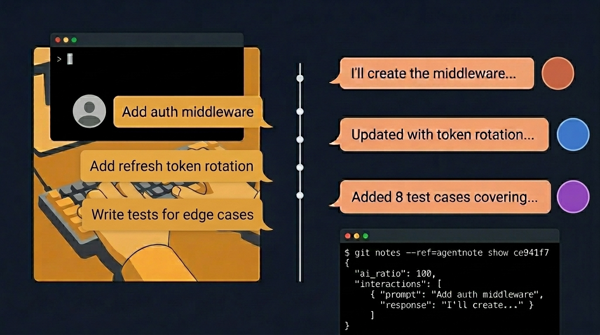

# Agentnote

<p align="center">
  
</p>

<p align="center">
  <a href="https://github.com/wasabeef/agentnote/actions"></a>
  <a href="./LICENSE"></a>
  <a href="https://www.npmjs.com/package/@wasabeef/agentnote"></a>
</p>

<p align="center"><strong>Know <em>why</em> your code changed, not just <em>what</em> changed.</strong></p>

Agentnote records every prompt you give to AI, every response it returns, and which files it wrote — then attaches it all to your git commits. When someone asks "why was this written this way?", the answer is one command away.

## Setup

```bash
npx @wasabeef/agentnote init
```

That's it. Hooks, GitHub Action workflow, and notes auto-fetch are all configured. Commit the generated files to share with your team.

## What You Get

### Every commit tells its story

```
$ agentnote show

commit:  ce941f7 feat: add JWT auth middleware
session: a1b2c3d4-5678-90ab-cdef-111122223333

ai:      60% [████████████░░░░░░░░]
files:   5 changed, 3 by AI

  CHANGELOG.md  👤
  src/middleware/auth.ts  🤖
  src/types/token.ts  🤖
  src/middleware/__tests__/auth.test.ts  🤖
  README.md  👤

prompts: 2

  1. Implement JWT auth middleware with refresh token rotation
     → I'll create the middleware with token verification and rotation...

  2. Add tests for expired token and invalid signature
     → Here are the test cases covering the edge cases...
```

### Scan your history at a glance

```
$ agentnote log

ce941f7 feat: add JWT auth middleware  [a1b2c3d4… | 🤖60% | 2p]
326a568 test: add auth tests          [a1b2c3d4… | 🤖100% | 1p]
ba091be fix: update dependencies
```

### Generate PR reports for code review

```
$ agentnote pr --format chat --update 42
agentnote: PR #42 description updated
```

Inserts a collapsible session transcript into the PR description — reviewers see every prompt and AI response right on the PR page:

<details>
<summary><code>dd4f971</code> feat: add Button component — AI 100% █████ · 1 files (1 🤖 0 👤)</summary>

> **🧑 Prompt**
> Create a shared Button component with variant support

**🤖 Response**

I'll create a Button component that accepts primary, secondary, and danger variants...

</details>

## How It Works

```
You prompt Claude Code
  → hooks capture the prompt
Claude writes code
  → hooks track which files were touched
You (or Claude) run git commit
  → Agentnote-Session trailer injected automatically
  → prompt + response + file attribution saved as git note
```

No extra commands needed. Just use `git commit` normally.

## What Gets Saved

Each commit gets a JSON note attached via `refs/notes/agentnote`:

```bash
$ git notes --ref=agentnote show ce941f7
```

```json
{
  "v": 1,
  "session_id": "a1b2c3d4-5678-90ab-cdef-111122223333",
  "timestamp": "2026-04-02T10:30:00Z",
  "ai_ratio": 60,
  "interactions": [
    {
      "prompt": "Implement JWT auth middleware with refresh token rotation",
      "response": "I'll create the middleware with token verification and automatic refresh..."
    },
    {
      "prompt": "Add tests for expired token and invalid signature",
      "response": "Here are the test cases covering the edge cases..."
    }
  ],
  "files_in_commit": [
    "src/middleware/auth.ts",
    "src/types/token.ts",
    "src/middleware/__tests__/auth.test.ts",
    "CHANGELOG.md",
    "README.md"
  ],
  "files_by_ai": [
    "src/middleware/auth.ts",
    "src/types/token.ts",
    "src/middleware/__tests__/auth.test.ts"
  ]
}
```

| Field | Description |
| --- | --- |
| `v` | Schema version |
| `ai_ratio` | % of files in the commit written by AI (file-count based) |
| `interactions` | Every prompt you gave and every response AI returned |
| `files_by_ai` | Files touched by AI (repo-relative paths, exact match) |
| `files_in_commit` | All files in the commit (AI + human) |

Notes are invisible to `git branch`, GitHub UI, and CI — but pushable and fetchable like any git ref.

## Commands

| Command | What it does |
| --- | --- |
| `agentnote init` | Set up hooks, workflow, and notes auto-fetch |
| `agentnote show [commit]` | Show the AI conversation behind a commit |
| `agentnote log [n]` | List recent commits with AI ratio |
| `agentnote pr [options]` | Generate PR report (`--format chat`, `--json`, `--update <pr#>`) |
| `agentnote status` | Show tracking state |
| `agentnote commit [args]` | Convenience wrapper for `git commit` (optional) |

## Share with Your Team

Session data is stored as [git notes](https://git-scm.com/docs/git-notes) — invisible to branch listings, GitHub UI, and CI.

```bash
# Push session data
git push origin refs/notes/agentnote

# Team members fetch it
git fetch origin refs/notes/agentnote:refs/notes/agentnote
```

## GitHub Action

Automatically post AI session reports on every PR:

```yaml
- uses: wasabeef/agentnote@v0
  id: agentnote
  with:
    base: main

# Use the data however you want
- if: fromJSON(steps.agentnote.outputs.json).overall_ai_ratio > 90
  run: echo "::warning::High AI ratio — consider extra review"
```

## Install

```bash
# Zero install (recommended)
npx @wasabeef/agentnote init

# Or as a dev dependency
npm install --save-dev @wasabeef/agentnote
```

## Requirements

- Node.js >= 20
- Git
- [Claude Code](https://docs.anthropic.com/en/docs/claude-code) (more agents coming)

## Design

- **Zero runtime dependencies** — just git + node
- **Git notes storage** — no branch pollution, no CI impact
- **Never breaks git commit** — all recording in try/catch
- **No telemetry** — data stays local unless you push it
- **Agent-agnostic architecture** — Claude Code today, Cursor / Gemini next

See [DESIGN.md](docs/knowledge/DESIGN.md) for architecture details.

## Contributing

See [CONTRIBUTING.md](CONTRIBUTING.md) for development setup and guidelines.

## License

MIT — see [LICENSE](LICENSE)
